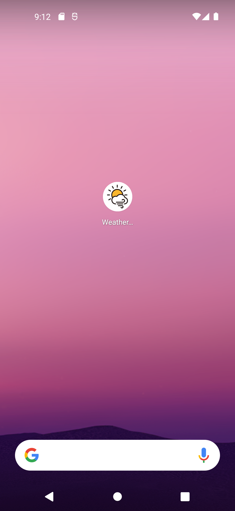
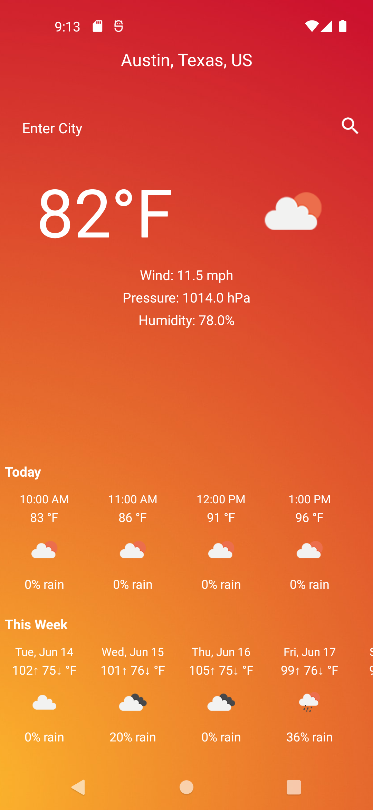
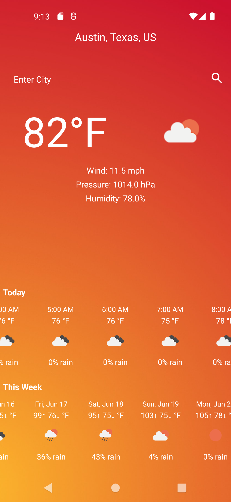
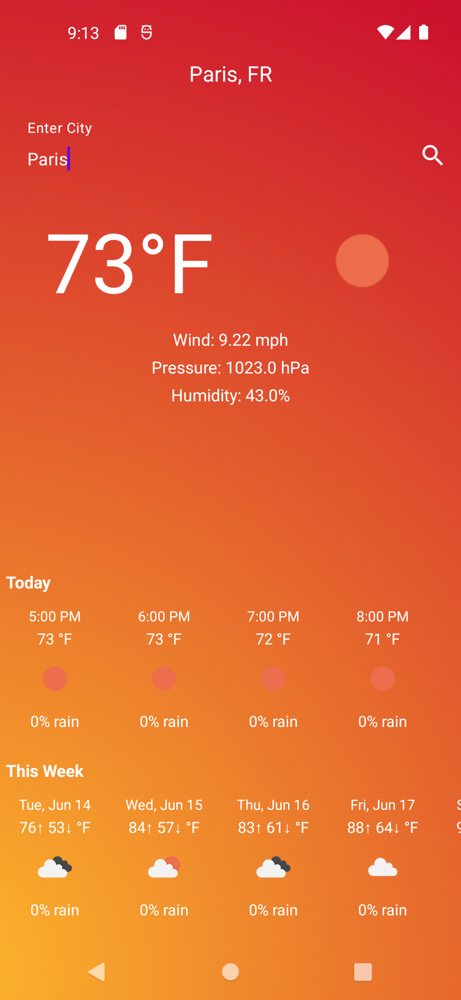
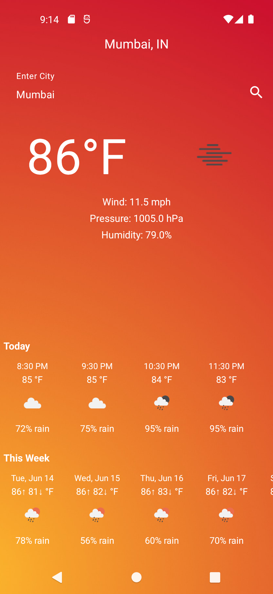
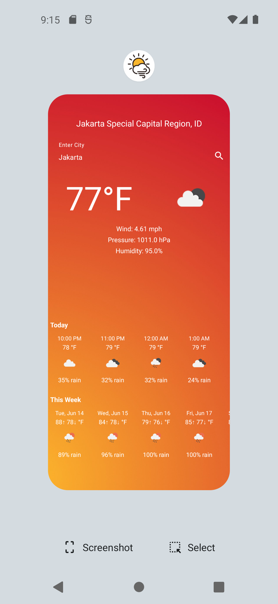

# WeatherApp
## About
WeatherApp is an app created by me, a UT student, to fulfill the project requirements (and more!) for a certain course. This app uses OpenWeatherMap -- an open source weather product provider -- to extract current, hourly, and daily weather data. It utilizes two of the many offered APIs: direct geocoding and onecall. Direct geocoding helps obtain usable latitude and longitude coordinates to be used in the onecall api call which grabs the necessary weather data.

## How To Use
My testing has primarily been on the Pixel 5 with API level 31. The app should work on higher API levels as well. 
Upon opening the app, the user should see auto-loaded Austin, Texas weather data. There is a search field at the top of the screen. Enter valid city names to change the display to show the weather data for each new city entered. Note: the keyboard must be dismissed once finished searching (i.e., it will not disappear automatically).

   

   
